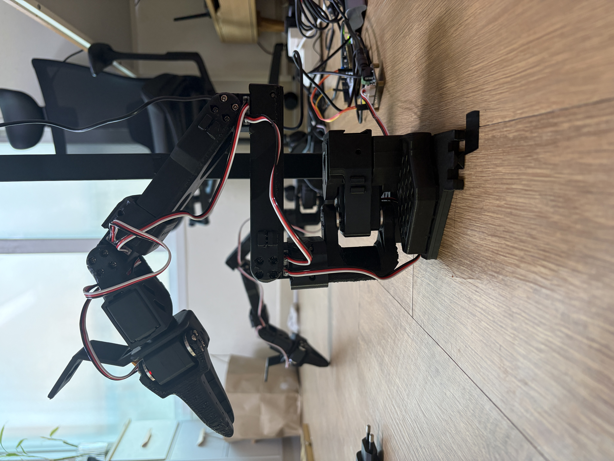
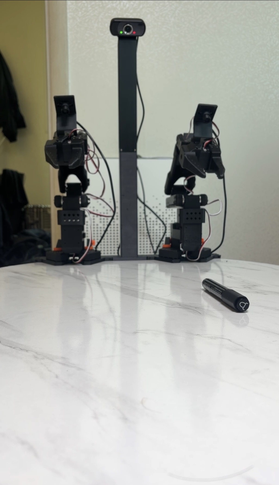

# 양팔 연속 펜 pick-and-place

Raspberry Pi 5, ROS 2 Jazzy, STM32G474, 두 대의 SO-ARM101과 세 대의 USB 카메라를 통합한 멀티카메라 듀얼암 로봇 프로젝트다. 상단 카메라로 마커펜을 인식해 왼팔이 집고, 중간에서 오른팔에 넘겨, 오른팔이 목표 위치에 내려놓는 **양팔 연속 Pick and Place**를 완주한다.

이 저장소는 이 지점에서 동결된 배포판이다. 후속 매니퓰레이션 태스크(캔→쓰레기통, 수건)는 별도 저장소에서 이어간다.

## Demo

  

  [](https://drive.google.com/file/d/11hQlSwHRJpI9FFg5H4HPeviVFf3yjjWv/view?usp=drive_link)
  click image to watch demo


## 무엇을, 어떻게

| | |
|---|---|
| **작업** | 상단 카메라 인식 → 왼팔 pick → 오른팔에 전달 → 오른팔 place, 자동 재시도 없이 연속 완주 |
| **인식** | Top-camera YOLO-OBB, 매 실행 동적 검출(사전 고정 치수 없음) |
| **제어** | Pi `bimanual_stream_adapter`(ROS 2)만 serial을 소유, protocol v2로 STM32 12관절 단일 stream. legacy `single_arm_bridge` 일반 trajectory backend는 비승인 |
| **안전** | 부팅 후 기본 `STANDBY`, 검증 게이트 통과 전 다음 단계로 안 감, 한 팔 fault 시 양팔 coordinated stop |
| **검증 완료** | resident firmware: F8.9 `0x00024809`, no-motion·current-pose hold 2회·좌→우 펜 전달 실기 통과 |

자세한 현재 상태는 [현재 상태](docs/CURRENT_STATE_AND_NEXT_ROADMAP.md), 상단 애플리케이션이 STM32와 주고받는 정확한 계약은 [양팔 상단 애플리케이션 인터페이스](docs/BIMANUAL_UPPER_APPLICATION_INTERFACE.md)에 있다.

## 핵심 원칙

- Raspberry Pi는 인식, TF, 계획, 상태 머신과 운영을 담당한다.
- STM32는 서보 버스 타이밍, 짧은 setpoint 보간, 제한, watchdog과 fault 처리를 담당한다.
- 부팅과 재연결만으로 로봇이 움직이지 않는다. 기본 상태는 `STANDBY`다.
- 모든 기능은 검증 게이트를 통과한 뒤 다음 단계로 이동한다.
- 성능과 안정성은 추측하지 않고 측정 결과를 남긴다.
- 실제 하드웨어 상수는 측정 전 코드 기본값으로 사용하지 않는다.

## 빠른 시작

```powershell
py -3.12 -m venv .venv-host
.\.venv-host\Scripts\Activate.ps1
python -m pip install -r requirements/host.txt
python -m unittest discover -s tests -p "test_*.py"
python tools\run\validate_protocol_manifest.py
```

STM32 펌웨어는 STM32CubeIDE 2.2.0 이상으로 `firmware/stm32_g474_single_arm`을 Existing Project로 import한다(상위 `firmware/stm32_actuator`가 linked resource이므로 두 디렉터리의 상대 위치는 유지). 실제 모터 점검 도구는 `tools/setup/stm32/stm32_*_test.py`에 있다 — 전원 차단 수단을 먼저 확보한다.

MoveIt은 backend 하나만 독점 선택한다(`mock`/`isaac`/`stm32`, 기본값은 실장치를 안 여는 `mock`).

```bash
ros2 launch so101_bringup so101_moveit.launch.py backend:=mock
```

개인 장치 serial 설정과 Pi 분산 구성은 [로컬 하드웨어 설정](docs/LOCAL_HARDWARE_CONFIG.md)에 있다.

## 자동 판정

```bash
python3 -m unittest discover -s tests -v
python3 tools/run/validate_protocol_manifest.py
python3 tools/run/validate_camera_schedule.py
```

Pi에서 ROS package까지 확인할 때는 다음을 추가로 실행한다.

```bash
cd ~/Manipulation/ros2_ws
source /opt/ros/jazzy/setup.bash
colcon build --symlink-install
colcon test
colcon test-result --verbose
```

## 저장소 구조

```text
Manipulation/
├── docs/
├── protocol/
├── firmware/stm32_actuator/          # 플랫폼 독립 C core
├── firmware/stm32_g474_single_arm/   # CubeIDE board project
├── ros2_ws/src/single_arm_bridge/    # Pi binary transport와 ROS 2 bridge
├── ros2_ws/src/so101_description/    # 왼팔 URDF/Xacro와 mesh
├── ros2_ws/src/so101_moveit_config/  # SRDF, planning, controller contract
├── ros2_ws/src/so101_bringup/        # mock/Isaac/STM32 통합 launch
├── ros2_ws/src/so101_isaac_bridge/   # MoveIt ↔ Isaac 물리 모델 mapping
├── ros2_ws/src/manipulation_camera_manager/ # V4L2 capture와 phase scheduler
├── isaac_sim/assets/                 # 단계 4에서 검증한 왼팔 simulation asset
├── models/                           # 학습된 검출기 가중치
├── config/
├── hardware/
├── tests/
└── tools/                            # run/lib/setup/diagnostics/contract_evidence — tools/README.md 참고
```

## 문서 안내

전체 실기 이력(125개 수락 기록)은 `docs/archive/test-results/`에 날짜순으로
보존돼 있다. 아래는 그중 지금도 유효한 핵심 문서만 추린 것이다.

**개요**

- [프로젝트 헌장](docs/PROJECT_CHARTER.md)
- [현재 상태](docs/CURRENT_STATE_AND_NEXT_ROADMAP.md)

**인터페이스·아키텍처**

- [양팔 상단 애플리케이션 인터페이스 계약](docs/BIMANUAL_UPPER_APPLICATION_INTERFACE.md)
- [Top-camera resident Pick/Place](docs/TOP_CAMERA_RESIDENT_PICK_PLACE_APPLICATION.md)
- [STM32 양팔 firmware 아키텍처](docs/FIRMWARE_DUAL_ARM_ARCHITECTURE.md)
- [Pi–STM32 통신 규격](protocol/README.md)
- [아키텍처 결정 기록(ADR)](docs/adr/README.md)

**하드웨어 bring-up**

- [하드웨어 인벤토리](docs/HARDWARE_INVENTORY.md)
- [단계 0 하드웨어 검사](docs/checklists/PHASE_0_HARDWARE_BASELINE.md)
- [STM32 단일 팔 실기 체크리스트](docs/checklists/STM32_SINGLE_ARM_BRINGUP.md)
- [단계 4 왼팔 Isaac Sim·MoveIt 체크리스트](docs/checklists/PHASE_4_ISAAC_MOVEIT_INTEGRATION.md)
- [단계 5 왼팔 hardware backend 체크리스트](docs/checklists/PHASE_5_LEFT_ARM_HARDWARE_BACKEND.md)
- [로컬 하드웨어 설정](docs/LOCAL_HARDWARE_CONFIG.md)

**펜 검출(YOLO-OBB)**

- [단계 8 Top 펜 검출 데이터 기준선](docs/checklists/STAGE8_TOP_PEN_DETECTION_BASELINE.md)
- [단계 8 경량 YOLO-OBB 펜 검출 후보](docs/checklists/STAGE8_TOP_PEN_YOLO_OBB.md)

**기타**

- [tools/ 분류표](tools/README.md)
- [제3자 license 고지](docs/THIRD_PARTY_NOTICES.md)

## License

자체 작성 코드는 [Apache License 2.0](LICENSE)으로 공개한다. STM32 HAL, CMSIS와 BSP는 각 원본 파일 및 [제3자 license 고지](docs/THIRD_PARTY_NOTICES.md)에 적힌 조건을 따른다.
